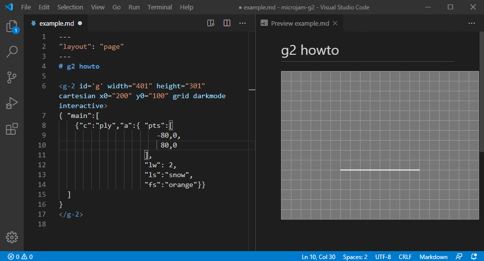

# g2

Using [g2](https://github.com/goessner/g2) with &mu;Jam is easy. A custom html element `<g-2>` with a predefined set of supported attributes can be injected in `html` as well as in `md` documents.

On top of that we get seamless integration into the markdown preview window of VSCode. 

<figure>
  
  <figcaption>Fig.1: Using g2 inside of markdown with VSCode</figcaption>
</figure>

You can see this [here live](./example.html). We can also combine `<g-2>` elements with inline scripts.

<figure>
  
  <figcaption>Fig.2: Combining g2 with markdown inline scripts</figcaption>
</figure>

You can see that triangle [live here](./triangle.html).